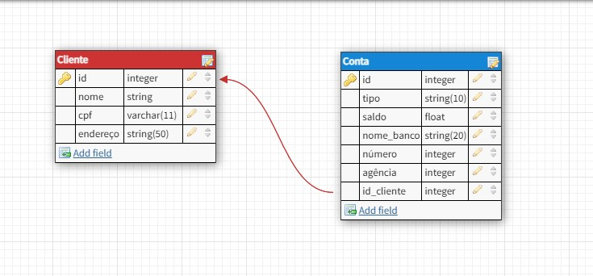

# Python_com_SQLite_e_MongoDB
 implementação de uma aplicação de integração com  o Banco de Dados Relacional com SQLAlchemy e com o anco de Dados NoSQL com Pymongo com base em um esquema relacional dentro do contexto de cliente e conta para criar as classes de sua API. 
 
 As classes representaram as tabelas do banco de dados relacional dentro da aplicação.

 
